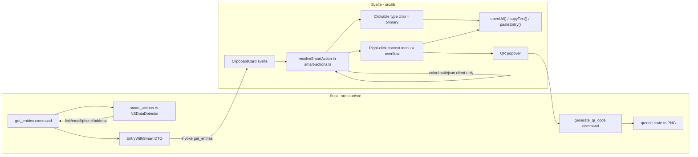

# Smart Actions — clipboard cards

**Status: shipped (unreleased).** On-device contextual actions per clipboard card (link, email, phone, address, color, math, JSON). No AI, no network.

**Related:** [features-backlog.md](features-backlog.md) · [feature-overlay-content-tag-filters.md](feature-overlay-content-tag-filters.md) · [audit-hig.md](audit-hig.md)

---

## Decisions locked in with the user

- **Detection engine:** hybrid, per user's explicit choice. Link / Email / Phone / Address use **native `NSDataDetector`** (Foundation, on-device, same engine Mail/Notes/Messages use) via `objc2-foundation`, because pure regex is unreliable for phone/address formats. Color / Math / JSON stay **pure TypeScript** (deterministic format checks, no ambiguity, zero benefit from a native detector).
- **QR code:** small, single-purpose Rust crate (`qrcode`), rendered server-side to PNG and returned as base64 — same shape as existing `image_thumb`/`source_app_icon` fields. No new frontend dependency.
- **No DB migration.** Smart-kind detection is computed at query time from `text_content` and attached to the API response only (not persisted). This matches the "no overhead" requirement, needs no backfill, and stays correct forever without drift.
- **URL opening (Open link / Compose email / FaceTime / FaceTime Audio / Message / Maps)** reuses the **already-installed** `tauri-plugin-opener` (`@tauri-apps/plugin-opener` is already a frontend dependency, used today in Settings). We only add a **scoped permission** restricting which URL schemes the main window may open — no new Rust command needed for this part.

## Architecture



**Why this shape:** `db.rs` stays a pure SQL layer (untouched). `smart_actions.rs` is a new, isolated, testable module (mirrors existing `image_format.rs` / `clipboard_macos/` pattern). All "do the action" calls reuse **existing** commands (`copy_text`, `paste_entry`) or the **existing** opener plugin — only two genuinely new pieces of backend surface: the detector module and `generate_qr_code`.

## Non-goals (v1)

- No date/transit-info detection (not requested).
- No network calls anywhere (link unfurling, geocoding, redirect-following) — matches "on-device, no model or network".
- Address action is "Open in Maps" only — no address-component parsing/validation beyond what `NSDataDetector` gives us.
- Smart-kind is not stored, filterable, or searchable (that's the separate, already-backlogged "URL / link recognition" filter feature in `docs/plans/features-backlog.md` — different goal, can layer on later without conflict).

---

## UI/UX — card anatomy

Smart Actions **do not change** overlay layout, filter bar, panel height, scroll-snap, or keyboard hints. Only the contents of a single [`ClipboardCard.svelte`](../../src/lib/components/ClipboardCard.svelte) change.

### Card zones (before / after)

```
┌─ ClipboardCard ─────────────────────────────────────────────┐
│ ZONE A  HEADER (.card-header)                             │
│ ┌─ ZONE A1: type chip ─────┐  ┌─ ZONE A2: actions ──────┐ │
│ │ [chip]  "2m ago"         │  │ hidden until hover/focus │ │
│ └──────────────────────────┘  └─────────────────────────┘ │
│ ZONE B  BODY (.card-body, fixed height)                   │
│ ┌─────────────────────────────────────────────────────────┐│
│ │ preview box (.text-preview / .image-preview)            ││
│ └─────────────────────────────────────────────────────────┘│
│ ZONE C  FOOTER (.card-footer) — unchanged                 │
│   AI tags (when enabled) · source app · char count        │
└───────────────────────────────────────────────────────────┘
│ OVERLAY (z-index 5): "Copied" flash — reused              │
└────────────────────────────────────────────────────────────┘
```

### What changes vs what stays

| Zone               | Without Smart Actions                        | With Smart Actions                                                                                                                                                                                                               |
| ------------------ | -------------------------------------------- | -------------------------------------------------------------------------------------------------------------------------------------------------------------------------------------------------------------------------------- |
| **A1 type chip**   | `Text` / `Image` / `PNG`                     | Smart kinds: clickable chip = **primary** (Open / Compose / FaceTime / Maps / Copy HEX / Copy result / Format). Kind icon + chevron affordance; Color uses swatch. Hint line under chip for link host / email / phone / address. |
| **A2 action bar**  | Paste · OCR? · Retag? · Pin · Delete         | **no new buttons** — smart actions do not use the action bar (Raycast/Alfred overflow)                                                                                                                                           |
| **Quick Look eye** | chip collapses into eye on hover             | Non-smart: unchanged collapse. **Smart:** chip stays; eye appears **beside** chip                                                                                                                                                |
| **Context menu**   | Preview only                                 | Smart primary + secondaries, then Preview (Alfred Universal Actions / Raycast ⌘K energy)                                                                                                                                         |
| **B body**         | plain text / mono for code                   | + math result line; + mono for JSON; color swatch in chip only                                                                                                                                                                   |
| **C footer**       | unchanged                                    | unchanged (smart chip ≠ filter chip, ≠ AI tag)                                                                                                                                                                                   |
| **Card click**     | single = copy entry, dbl/Enter = paste entry | **unchanged** — smart chip / menu `stopPropagation`                                                                                                                                                                              |
| **Copied overlay** | after copy entry                             | also after copyText from a smart action                                                                                                                                                                                          |

### Action bar visibility (existing pattern, unchanged)

```
State              Paste  Pin  Delete   Smart chip   Quick Look eye
──────────────────────────────────────────────────────────────────
idle (no hover)    hidden pin* hidden   always       hidden
card:hover         visible visible      always       beside chip (smart) / collapse (plain)
keyboard focus     visible visible      always       beside chip (smart) / collapse (plain)
```

`*` pinned card: pin button always visible (existing behavior).

### ZONE A2 button order (left to right) — no smart icons

```
[Paste]  [Copy OCR?]  [Retag?]  [Pin]  [Delete]
 ↑ existing chain unchanged — no SmartPrimary / ⋮ in the bar
```

### Overflow = context menu (Raycast ⌘K / Alfred Universal Actions)

```
Right-click card →
  ┌─ Smart actions ─────────────────┐
  │ Open link          (primary)    │
  │ Copy tracking-free URL          │
  │ Make QR code                    │
  ├─────────────────────────────────┤
  │ Preview                         │
  └─────────────────────────────────┘

QR (Link only) → centered dialog:
              ┌──────────────┐
              │  [QR image]  │
              │   [Dismiss]  │
              └──────────────┘
              lazy: generateQrCode() only on click
```

Dev gallery: `/dev/smart-actions`. Demo DB seed: `make seed-demo` or `/dev/seed`.

### Feedback after smart actions

| Action type                              | UI feedback                                                       |
| ---------------------------------------- | ----------------------------------------------------------------- |
| Copy (HEX, result, JSON, address…)       | existing **Copied overlay** + `aria-live="Copied to clipboard"`   |
| Paste result                             | no overlay; panel hides + paste pipeline (same as Paste)          |
| Open URL (browser, Mail, FaceTime, Maps) | **no overlay**; panel may stay open (external app focus)          |
| QR popover                               | popover open → dismiss; no copied flash unless "Copy image" added |

### When the UI updates (data flow)

```
1. New capture
   clipboard_monitor → DB insert → event clipboard-changed
   → overlay fetch page 0 → get_entries
   → Rust attach_smart_action (link/email/phone/address)
   → Svelte resolveSmartAction (color/math/json)
   → card shows the correct chip immediately

2. Scroll / pagination
   get_entries batch → each entry already has smart_kind
   → $derived recomputes chip/actions without extra IPC

3. Retag / OCR update
   smart UI does NOT depend on tags/ocr → chip unchanged

4. Hover smart button
   CSS opacity only — no re-fetch, no re-detect
```

### Compact vertical board (`board_vertical`)

Same zones A/B/C in the compact card. SmartPrimary + SmartMore remain; when space is tight the action bar **must not wrap** (existing `flex-wrap: nowrap`) — smart buttons on the left, delete on the right; overflow hidden as today.

---

## UI/UX — flow diagrams per feature

Below: **idle** (no hover) and **hover** for each kind. `[…]` = truncated preview.

---

### 1. Link

**Detection:** Rust `NSDataDetector` → `smart_kind: "link"`, `smart_value: url`

**Idle:**

```
┌─ Card ────────────────────────────────────────────────┐
│ A1: ( Link )          2m ago                          │
│ A2: [hidden]                                          │
│ B:  ┌──────────────────────────────────────────────┐  │
│     │ https://github.com/org/repo?utm_source=x     │  │
│     └──────────────────────────────────────────────┘  │
│ C:  Safari · 42 characters                            │
└───────────────────────────────────────────────────────┘
```

**Hover:**

```
│ A2: [↗ Open] [⋮] [Paste] [Pin] [Delete]               │
         │       │
         │       └─ popover:
         │            · Copy tracking-free URL
         │            · Make QR code → QR popover
         └─ openUrl(original url) → default browser
```

**Interaction flow:**

```
User copies URL
  → card appears with chip "Link"
  → hover → tap ↗ Open
      → openUrl(url) → browser opens (panel may stay)
  → OR tap ⋮ → "Copy tracking-free URL"
      → copyText(cleanUrl) → Copied overlay
  → OR tap ⋮ → "Make QR code"
      → generateQrCode(url) → show QR popover (async ~50ms)
  → OR single-click card body
      → copyEntry(id) → copies ORIGINAL url (with utm) — unchanged behavior
```

---

### 2. Email

**Detection:** Rust NSDataDetector (mailto link or bare email)

**Idle:**

```
┌─ Card ────────────────────────────────────────────────┐
│ A1: ( Email )         5m ago                          │
│ B:  ┌──────────────────────────────────────────────┐  │
│     │ jane.doe@company.com                         │  │
│     └──────────────────────────────────────────────┘  │
└───────────────────────────────────────────────────────┘
```

**Hover:**

```
│ A2: [✉ Compose] [⋮] [Paste] [Pin] [Delete]            │
         │          └─ · Copy address
         └─ openUrl("mailto:jane.doe@company.com")
```

**Interaction flow:**

```
tap ✉ Compose → Mail.app / default mail client, To: prefilled
tap ⋮ Copy address → copyText(address) → Copied overlay
single-click card → copyEntry → full original text
dbl-click / Enter → paste original into target app
```

---

### 3. Phone

**Detection:** Rust NSDataDetector, whole-string dominance

**Idle:**

```
┌─ Card ────────────────────────────────────────────────┐
│ A1: ( Phone )         1h ago                          │
│ B:  ┌──────────────────────────────────────────────┐  │
│     │ +1 (415) 555-2671                            │  │
│     └──────────────────────────────────────────────┘  │
└───────────────────────────────────────────────────────┘
```

**Hover:**

```
│ A2: [📹 FaceTime] [⋮] [Paste] [Pin] [Delete]        │
           │           └─ · FaceTime Audio
           │              · Message
           └─ openUrl("facetime:+14155552671")
```

**Interaction flow:**

```
tap 📹 → FaceTime video prompt
tap ⋮ → FaceTime Audio → openUrl("facetime-audio:…")
tap ⋮ → Message → openUrl("sms:…")
card click → copy original formatted number (unchanged)
```

---

### 4. Address

**Detection:** Rust NSDataDetector address type, dominance ≥85%

**Idle + Hover (no ⋮ menu):**

```
┌─ Card ────────────────────────────────────────────────┐
│ A1: ( Address )       3m ago                          │
│ A2: [📍 Maps] [Paste] [Pin] [Delete]    ← hover only │
│ B:  ┌──────────────────────────────────────────────┐  │
│     │ 1 Infinite Loop, Cupertino, CA               │  │
│     └──────────────────────────────────────────────┘  │
└───────────────────────────────────────────────────────┘
         │
         └─ openUrl("maps://?address=" + encodeURIComponent(text))
            → Apple Maps
```

**Interaction flow:**

```
tap 📍 Maps → Maps opens with address query
no secondary menu (single obvious action per HIG)
card click → copy full address string
```

---

### 5. Color

**Detection:** TS client-only, whole-string hex/rgb/rgba

**Idle:**

```
┌─ Card ────────────────────────────────────────────────┐
│ A1: ( ■ #3A7BD5  Color )   ← swatch 12×12 in chip    │
│ B:  ┌──────────────────────────────────────────────┐  │
│     │ #3A7BD5                                      │  │
│     └──────────────────────────────────────────────┘  │
└───────────────────────────────────────────────────────┘
     swatch background = actual color; border if near-white
```

**Hover:**

```
│ A2: [⎘ Copy HEX] [⋮] [Paste] [Pin] [Delete]         │
           │          └─ · Copy rgb(58, 123, 213)
           │             · Copy SwiftUI Color(…)
           └─ copyText("#3A7BD5") → Copied overlay
```

**Also works for input `rgb(58, 123, 213)`:**

```
chip: ( ■ Color )   body shows original rgb() string
primary copies normalized #3A7BD5
```

**Interaction flow:**

```
instant on render — no async
tap Copy HEX / menu variants → copyText → Copied overlay
card click → copyEntry → original pasted color string
```

---

### 6. Math (Calc)

**Detection:** TS client-only, expression parser

**Idle:**

```
┌─ Card ────────────────────────────────────────────────┐
│ A1: ( Calc )          just now                        │
│ B:  ┌──────────────────────────────────────────────┐  │
│     │ 18*24+7                                        │  │
│     │ = 439                          ← secondary line│  │
│     └──────────────────────────────────────────────┘  │
│         (.text-content--ocr style, muted)             │
└───────────────────────────────────────────────────────┘
```

**Hover:**

```
│ A2: [⎘ Copy result] [⋮] [Paste] [Pin] [Delete]      │
           │             └─ · Paste result
           └─ copyText("439") → Copied overlay
```

**Interaction flow:**

```
result computed in $derived on every render — O(1), no IPC
tap Copy result → copyText(result) → Copied overlay
tap ⋮ Paste result → pasteEntry(result) → hide panel + paste "439"
card click → copyEntry → copies "18*24+7" (expression, not result)
dbl-click card → paste expression into target (unchanged)
```

---

### 7. JSON

**Detection:** TS client-only, `JSON.parse` whole string

**Idle:**

```
┌─ Card ────────────────────────────────────────────────┐
│ A1: ( JSON )          2m ago                          │
│ B:  ┌──────────────────────────────────────────────┐  │
│     │ {"user":"alice","roles":["admin"]}  ← mono    │  │
│     └──────────────────────────────────────────────┘  │
│         usesMonoPreview = true (existing mono path)   │
└───────────────────────────────────────────────────────┘
```

**Hover:**

```
│ A2: [{} Format] [⋮] [Paste] [Pin] [Delete]          │
          │          └─ · Minify
          │             · Paste formatted
          └─ copyText(pretty JSON, 2-space indent) → Copied overlay
```

**Interaction flow:**

```
tap Format → copy pretty-printed JSON → Copied overlay
tap ⋮ Minify → copy minified single-line → Copied overlay
tap ⋮ Paste formatted → pasteEntry(formatted) → target gets pretty JSON
card click → copyEntry → original minified string from clipboard history
```

---

### Negative case — plain Text (no smart match)

```
┌─ Card ────────────────────────────────────────────────┐
│ A1: ( Text )          2m ago        ← unchanged       │
│ A2: [Paste] [Pin] [Delete]          ← no smart btns   │
│ B:  Call me at 555-1234 tomorrow    ← stays Text      │
│     (phone mentioned but not dominant → not Phone)    │
└───────────────────────────────────────────────────────┘
```

---

### Keyboard / a11y (all kinds)

```
Tab to selected card → focus ring on card
Tab into action bar → SmartPrimary → SmartMore → Paste → …
SmartMore: Enter/Space opens menu; ↑↓ navigate; Enter selects
Each button: aria-label mirrors title ("Open link", "Copy HEX", …)
Screen reader on copy: existing aria-live region announces result
Smart action keys do NOT hijack ←/→ card navigation (overlay global)
```

---

## Phase 1 — Client-side detectors (Color, Math, JSON): no backend changes

**New file:** [`src/lib/smart-actions.ts`](../../src/lib/smart-actions.ts)

```typescript
export type SmartKind = "link" | "email" | "phone" | "address" | "color" | "math" | "json";

export type SmartActionInfo =
  | { kind: "link"; url: string; cleanUrl: string; host: string }
  | { kind: "email"; address: string }
  | { kind: "phone"; number: string }
  | { kind: "address"; text: string }
  | { kind: "color"; hex: string; rgb: string; swiftUI: string }
  | { kind: "math"; expression: string; result: string }
  | { kind: "json"; formatted: string; minified: string };

export const SMART_KIND_LABEL: Record<SmartKind, string> = {
  link: "Link",
  email: "Email",
  phone: "Phone",
  address: "Address",
  color: "Color",
  math: "Calc",
  json: "JSON",
};
```

- `isValidJson(text)` — extract from the existing JSON branch in `detectTextKind` (`ClipboardCard.svelte:67-74`) so both call sites share one implementation (DRY). `detectJson(text)` builds `{formatted: JSON.stringify(parsed, null, 2), minified: JSON.stringify(parsed)}`.
- `detectColor(text)` — regexes for whole-string hex (`#RGB`/`#RGBA`/`#RRGGBB`/`#RRGGBBAA`) and `rgb()`/`rgba()`. Compute `hex`, `rgb`, and `swiftUI` (`Color(red: 0.23, green: 0.48, blue: 0.84)`, 3 decimals).
- `detectMath(text)` — prefilter `^[\d+\-*/%^().\s]+$` **and** must contain an operator; reject a lone signed number. Evaluate with a small hand-written recursive-descent parser (`evaluateMathExpression`) — **no `eval()`**, standard precedence (`^` right-assoc, then `* / %`, then `+ -`, parens, unary minus). Return `null` on parse error, division-by-zero, or non-finite result. Format result trimmed to 6 significant digits, no trailing zeros.
- `stripTrackingParams(url)` — remove a fixed denylist of query keys (`utm_*`, `fbclid`, `gclid`, `gclsrc`, `dclid`, `msclkid`, `mc_cid`, `mc_eid`, `igshid`, `si`, `ref`, `ref_src`, `spm`, `yclid`, `twclid`, `_hsenc`, `_hsmi`, `mkt_tok`), rebuild the URL, drop an empty trailing `?`.
- `resolveSmartAction(entry: ClipboardEntry): SmartActionInfo | null` — precedence: server `entry.smart_kind` (link/email/phone/address, Phase 3) first, else client detectors in order color → math → json. Exhaustive `switch` with `satisfies never` default, matching the project's `typescript-exhaustive-switch` convention already used in [`overlay-filters.ts:51`](../../src/lib/overlay-filters.ts).

**Test file:** [`src/lib/smart-actions.test.ts`](../../src/lib/smart-actions.test.ts) (Node `--test`, same style as [`image-meta.test.ts`](../../src/lib/image-meta.test.ts)):

- Color: `#3A7BD5`, `#fff`, `rgb(58, 123, 213)`, `rgba(0,0,0,0.5)` → correct hex/rgb/swiftUI; reject `"redish"`, a hex embedded mid-sentence.
- Math: `"18*24+7"` → `439`; `"(2+3)*4"` → `20`; `"10/0"` → `null`; `"2024"` (no operator) → `null`; `"not math"` → `null`.
- JSON: `'{"a":1}'` → formatted/minified pair; `"{not json"` → `null`.
- `stripTrackingParams`: strips `utm_source`/`fbclid`, keeps real params, handles no-query URLs unchanged.
- `resolveSmartAction`: precedence ordering, `content_type !== "text"` → `null`.

**Refactor:** `detectTextKind` in [`ClipboardCard.svelte:60-87`](../../src/lib/components/ClipboardCard.svelte) calls the shared `isValidJson` instead of its own inline JSON check (removes duplication, behavior unchanged).

Run `make check-frontend` after this phase — fully working, testable, and shippable on its own with zero backend/native-code risk.

---

## Phase 2 — Card UI: type chip, action bar, popover menu

**Modify** [`ClipboardCard.svelte`](../../src/lib/components/ClipboardCard.svelte):

- `const smartAction = $derived(entry.content_type === "text" ? resolveSmartAction(entry) : null);`
- `typeLabel` precedence becomes: image format badge (unchanged) → `SMART_KIND_LABEL[smartAction.kind]` → existing text/image/file fallback.
- **Color kind:** render a small swatch (`<span class="color-swatch" style="background:{smartAction.hex}">`) inside `.type-label`, before the text label — mirrors how the image format badge already sits inside the same chip.
- **Math kind:** body preview gets a second line `= {result}` styled like the existing OCR secondary line (`.text-content--ocr`, [`ClipboardCard.svelte:820`](../../src/lib/components/ClipboardCard.svelte)) — reuse that visual language (quieter secondary tone) rather than inventing a new style.
- **Action bar:** prepend **one** primary smart-action icon button to `.card-actions` (before Paste), plus a compact **"more" trigger** icon button when the kind has secondary actions (email/phone have 1-2 extra, link has 2, color has 2, math has 1, json has 2; address has none). Both use the existing `.action-btn.app-btn` class so hover/focus/sizing (`--size-card-action-hit`, `--icon-size-card-action`) come for free — no new CSS component needed for the buttons themselves.
- Primary action mapping (exactly one button per kind, calls into a new `handleSmartPrimary()` that switches on `smartAction.kind`):

| Kind    | Primary button                                                          | Secondary (popover)                  |
| ------- | ----------------------------------------------------------------------- | ------------------------------------ |
| link    | Open (`openUrl(url)`)                                                   | Copy tracking-free URL, Make QR code |
| email   | Compose (`openUrl("mailto:" + address)`)                                | Copy address                         |
| phone   | FaceTime (`openUrl("facetime:" + number)`)                              | FaceTime Audio, Message              |
| address | Open in Maps (`openUrl("maps://?address=" + encodeURIComponent(text))`) | — (no menu)                          |
| color   | Copy HEX (`copyText(hex)`)                                              | Copy rgb(), Copy SwiftUI Color       |
| math    | Copy result (`copyText(result)`)                                        | Paste result (`pasteEntry(result)`)  |
| json    | Format (`copyText(formatted)`)                                          | Minify, Paste formatted              |

All "copy"/"paste" secondary actions reuse the **existing** `copyText` / `pasteEntry` wrappers in [`api.ts:272-295`](../../src/lib/api.ts) — no backend change for any of these.

**New component:** [`src/lib/components/CardActionMenu.svelte`](../../src/lib/components/CardActionMenu.svelte) — compact icon-only popover trigger (not the settings-style `ActionMenu.svelte`, which always renders a text label + chevron and isn't suited to a 24px icon button). Keep it small and purpose-built (SRP): open on click, close on Escape/outside-click/selection, `role="menu"`/`role="menuitem"`, arrow-key navigation between the 1-3 items. Reuses the popover panel look.

**Shared style extraction (small, targeted refactor):** pull `.action-menu-panel` / `.action-menu-item` rules out of `ActionMenu.svelte`'s local `<style>` into `button-interaction.css` as `.popover-menu` / `.popover-menu-item`, then point both `ActionMenu.svelte` and `CardActionMenu.svelte` at the shared classes. Avoids two near-identical popover implementations (DRY), stays scoped to what this feature touches.

New inline SVG icons needed in `ClipboardCard.svelte` (24×24, `stroke-width="2"`, round caps — matching the existing retag/pin/delete icons already in the file): external-link (open), mail (compose), video (FaceTime), phone (FaceTime Audio / Message), map-pin (Maps), equals-sign (calc, two horizontal lines — literal "= result"), braces (JSON), more-horizontal (menu trigger, 3 filled dots).

Run `make check-frontend`.

---

## Phase 3 — Native detection: Link / Email / Phone / Address

**New file:** [`src-tauri/src/smart_actions.rs`](../../src-tauri/src/smart_actions.rs)

```rust
#[derive(Debug, Clone, Copy, PartialEq, Eq)]
pub enum SmartKind { Link, Email, Phone, Address }

impl SmartKind {
    pub fn as_str(self) -> &'static str {
        match self {
            SmartKind::Link => "link",
            SmartKind::Email => "email",
            SmartKind::Phone => "phone",
            SmartKind::Address => "address",
        }
    }
}

pub struct SmartMatch {
    pub kind: SmartKind,
    pub value: String,
}

/// Only tag a card when a single detected match dominates the whole
/// (trimmed) text, so a paragraph that merely *mentions* a phone number
/// doesn't get miscategorized as a "Phone" card.
const DOMINANCE_RATIO: f64 = 0.85;
const MAX_DETECT_LEN: usize = 2000;

#[cfg(target_os = "macos")]
pub fn detect(text: &str) -> Option<SmartMatch> {
    // implementation below
}

#[cfg(not(target_os = "macos"))]
pub fn detect(_text: &str) -> Option<SmartMatch> {
    None
}
```

macOS implementation (verified against `objc2-foundation` docs — `NSDataDetector`, `NSTextCheckingResult` are pre-generated safe bindings, no raw `msg_send!` needed):

```rust
#[cfg(target_os = "macos")]
pub fn detect(text: &str) -> Option<SmartMatch> {
    let trimmed = text.trim();
    if trimmed.is_empty() || trimmed.len() > MAX_DETECT_LEN {
        return None;
    }

    use objc2_foundation::{NSDataDetector, NSString, NSRange, NSTextCheckingType};

    let checking_types = NSTextCheckingType::Link.0
        | NSTextCheckingType::PhoneNumber.0
        | NSTextCheckingType::Address.0;

    let detector = unsafe { NSDataDetector::dataDetectorWithTypes_error(checking_types) }.ok()?;
    let ns_text = NSString::from_str(trimmed);
    // NSRange is UTF-16 code units, NOT bytes — use ns_text.length(), not trimmed.len().
    let full_range = NSRange { location: 0, length: ns_text.length() };
    let matches = unsafe {
        detector.matchesInString_options_range(&ns_text, objc2_foundation::NSMatchingOptions::empty(), full_range)
    };

    let dominant = matches.iter().max_by_key(|m| m.range().length)?;
    if (dominant.range().length as f64) < (full_range.length as f64) * DOMINANCE_RATIO {
        return None;
    }

    match dominant.resultType() {
        t if t == NSTextCheckingType::Link => {
            let url = unsafe { dominant.URL() }?;
            let absolute = url.absoluteString()?.to_string();
            if absolute.starts_with("mailto:") {
                Some(SmartMatch { kind: SmartKind::Email, value: absolute.trim_start_matches("mailto:").to_owned() })
            } else {
                Some(SmartMatch { kind: SmartKind::Link, value: absolute })
            }
        }
        t if t == NSTextCheckingType::PhoneNumber => {
            let phone = unsafe { dominant.phoneNumber() }?;
            Some(SmartMatch { kind: SmartKind::Phone, value: phone.to_string() })
        }
        t if t == NSTextCheckingType::Address => {
            // Use the raw matched substring (UTF-16 range -> Rust String),
            // not addressComponents(), since Maps accepts free-form text.
            let utf16: Vec<u16> = trimmed.encode_utf16().collect();
            let range = dominant.range();
            let slice = utf16.get(range.location as usize..(range.location + range.length) as usize)?;
            Some(SmartMatch { kind: SmartKind::Address, value: String::from_utf16(slice).ok()? })
        }
        _ => None,
    }
}
```

> **Verification step for the implementer:** the exact method names above (`dataDetectorWithTypes_error`, `matchesInString_options_range`, `resultType`, `URL`, `phoneNumber`, `range`) are confirmed against current `objc2-foundation` docs.rs, but run `cargo doc -p objc2-foundation --open` (or check `docs.rs/objc2-foundation`) before wiring this up, since generated-binding signatures shift between crate versions. The **UTF-16 range gotcha is the one detail most likely to cause subtle bugs** (wrong slicing on non-ASCII/Cyrillic text) — cover it explicitly in tests.

**Modify** [`src-tauri/Cargo.toml`](../../src-tauri/Cargo.toml) — extend the existing `objc2-foundation` feature list (currently `NSArray, NSString, NSDictionary, NSValue, NSObject, NSData, NSBundle, NSURL, NSNotification, NSOperation, NSError, NSObjCRuntime, block2`) to add: `"NSRegularExpression", "NSTextCheckingResult", "NSRange"`.

**Rust tests** (in `smart_actions.rs`, `#[cfg(test)] mod tests`, macOS-only via `#[cfg(target_os = "macos")]` on the test module):

- `"Call me at (415) 555-2671"` → dominance ratio too low → `None` (mentions a phone, isn't one).
- `"(415) 555-2671"` alone → `Phone`.
- `"john@example.com"` → `Email` (via mailto).
- `"https://example.com/page?utm_source=x"` → `Link`, value includes the full URL.
- `"Улица Пушкина, дом Колотушкина, 1"` (Cyrillic) → confirms UTF-16 slicing round-trips correctly if detected as `Address` (if NSDataDetector doesn't recognize this specific string, use any Cyrillic string forced through the slicing helper as a unit test of the UTF-16 conversion in isolation).
- Empty string / >2000 chars → `None` (no native call, or immediate `None` before it).

**Modify** [`src-tauri/src/commands.rs`](../../src-tauri/src/commands.rs) — do **not** touch `db.rs` or the `ClipboardEntry` struct (keeps it a pure DB-row mirror). Add a response DTO and change `get_entries`' return type:

```rust
#[derive(Serialize)]
pub struct EntryWithSmart {
    #[serde(flatten)]
    pub entry: ClipboardEntry,
    #[serde(skip_serializing_if = "Option::is_none")]
    pub smart_kind: Option<&'static str>,
    #[serde(skip_serializing_if = "Option::is_none")]
    pub smart_value: Option<String>,
}

fn attach_smart_action(entry: ClipboardEntry) -> EntryWithSmart {
    let detected = (entry.content_type == "text")
        .then(|| entry.text_content.as_deref())
        .flatten()
        .and_then(crate::smart_actions::detect);
    EntryWithSmart {
        entry,
        smart_kind: detected.as_ref().map(|m| m.kind.as_str()),
        smart_value: detected.map(|m| m.value),
    }
}
```

`get_entries` (`commands.rs:24-50`) return type becomes `Result<Vec<EntryWithSmart>, String>`, mapping `db.get_entries(...)?.into_iter().map(attach_smart_action).collect()`.

**Modify** [`src/lib/types.ts`](../../src/lib/types.ts) — add to `ClipboardEntry`:

```typescript
/** Computed at query time from text_content via NSDataDetector; not persisted. */
smart_kind?: "link" | "email" | "phone" | "address" | null;
smart_value?: string | null;
```

**Modify `resolveSmartAction`** (Phase 1 file) to consume `entry.smart_kind`/`entry.smart_value` first, building `cleanUrl`/`host` for link via `stripTrackingParams`/`new URL()`.

Run `make check-backend` (Rust) then `make check-frontend`, then `make check` for the full gate.

---

## Phase 4 — Open actions via the existing opener plugin (no new command)

**Modify** [`src-tauri/capabilities/main.json`](../../src-tauri/capabilities/main.json) — add a **scoped** opener permission (the plugin is already initialized in [`lib.rs:468`](../../src-tauri/src/lib.rs) and already a settings-only capability today):

```json
{
  "$schema": "../gen/schemas/desktop-schema.json",
  "identifier": "main",
  "description": "Main clipboard panel window",
  "windows": ["main"],
  "permissions": [
    "core:event:default",
    "main-window-commands",
    {
      "identifier": "opener:allow-open-url",
      "allow": [
        { "url": "https:*" },
        { "url": "http:*" },
        { "url": "mailto:*" },
        { "url": "facetime:*" },
        { "url": "facetime-audio:*" },
        { "url": "sms:*" },
        { "url": "maps:*" }
      ]
    }
  ]
}
```

> Verify the exact scope object shape against the regenerated `gen/schemas/desktop-schema.json` (run `npm run tauri dev` once to regenerate) — Tauri v2 plugin scopes commonly use this `{"url": "pattern"}` shape but confirm before relying on it in code review.

**Modify** `ClipboardCard.svelte` — import `openUrl` from `@tauri-apps/plugin-opener` (already a dependency, same import already used in `settings/+page.svelte`) and call it directly for Open/Compose/FaceTime/FaceTime Audio/Message/Maps. No Rust changes in this phase.

Run `make check`, then a manual smoke test (see Manual QA below) since capability scoping can't be caught by `svelte-check`/`cargo check` — a wrong scheme allow-pattern only fails at runtime.

---

## Phase 5 — QR code generation for links

**Modify** [`src-tauri/Cargo.toml`](../../src-tauri/Cargo.toml) — add `qrcode = "0.14"` (pure Rust, no OS bindings, cross-platform — safe for the Windows experimental build too). Reuse the **already-present** `image` crate to encode the generated matrix as PNG bytes.

**New file:** [`src-tauri/src/qr_code.rs`](../../src-tauri/src/qr_code.rs):

```rust
use base64::Engine;
use qrcode::{QrCode, render::svg}; // or bitmap render, see note below
use image::{Luma, ImageBuffer};

pub fn generate_qr_png_base64(data: &str) -> Result<String, String> {
    let code = QrCode::new(data.as_bytes()).map_err(|e| e.to_string())?;
    let image: ImageBuffer<Luma<u8>, Vec<u8>> = code.render::<Luma<u8>>()
        .quiet_zone(true)
        .module_dimensions(8, 8)
        .build();
    let mut png_bytes: Vec<u8> = Vec::new();
    image::DynamicImage::ImageLuma8(image)
        .write_to(&mut std::io::Cursor::new(&mut png_bytes), image::ImageFormat::Png)
        .map_err(|e| e.to_string())?;
    Ok(base64::engine::general_purpose::STANDARD.encode(png_bytes))
}
```

> Confirm the `qrcode` crate's exact `render()` builder API (module dimensions / quiet zone method names) against `docs.rs/qrcode` when implementing — the shape above is representative of the crate's public API but double-check before shipping.

**Modify `commands.rs`** — add:

```rust
#[tauri::command]
pub fn generate_qr_code(data: String) -> Result<String, String> {
    if data.trim().is_empty() || data.len() > 2000 {
        return Err("Invalid QR payload".to_owned());
    }
    crate::qr_code::generate_qr_png_base64(&data)
}
```

**Modify** [`src-tauri/src/lib.rs`](../../src-tauri/src/lib.rs) — register `generate_qr_code` in `generate_handler!`.

**Modify** [`src-tauri/permissions/main-commands.toml`](../../src-tauri/permissions/main-commands.toml) — add `"generate_qr_code"` to `commands.allow`.

**Modify** [`src/lib/api.ts`](../../src/lib/api.ts):

```typescript
export async function generateQrCode(data: string): Promise<string> {
  return invoke("generate_qr_code", { data });
}
```

**UI:** "Make QR code" (link secondary action) opens a small popover/overlay showing `` with a "Copy image" affordance if trivial, else just a dismiss button (Escape / click-outside) — reuse `CardActionMenu.svelte`'s popover positioning primitives rather than building new overlay plumbing.

**Rust test:** `generate_qr_png_base64("https://example.com")` returns a non-empty base64 string that decodes to valid PNG bytes (check PNG magic number `\x89PNG`).

Run `make check`.

---

## Phase 6 — Docs and verification

- Update [features-backlog.md](features-backlog.md): move Smart Actions from idea to a tracked entry (mirroring the existing "URL / link recognition" entry's format) once shipped; note it's a **different, complementary** feature from that backlog item (this one is per-card actions, that one is DB-backed filtering).
- Update [CHANGELOG.md](../../CHANGELOG.md) per repo convention.
- Full gate: `make fix && make check` (frontend: `svelte-check`, Oxlint, Oxfmt, Stylelint, Node `--test`; backend: `cargo fmt`, `cargo clippy -D warnings --all-targets`, `cargo test`).

---

## Manual QA checklist (final, end-to-end)

Run the dev app (`npm run tauri dev`) and verify on real macOS with actual apps (Mail, Messages, FaceTime, Maps installed):

- **Link:** copy `https://example.com?utm_source=test&id=1` → chip shows "Link"; primary **Open** launches default browser; menu **Copy tracking-free URL** copies `https://example.com?id=1`; **Make QR code** shows a scannable QR (verify with a phone camera) for the _original_ URL.
- **Email:** copy `jane@example.com` → chip "Email"; **Compose** opens Mail.app with To: pre-filled; menu **Copy address** copies the raw string.
- **Phone:** copy `+1 (415) 555-2671` → chip "Phone"; **FaceTime** prompts FaceTime video call; menu **FaceTime Audio** and **Message** open the right apps.
- **Address:** copy a real street address → chip "Address"; **Open in Maps** opens Apple Maps centered/searched on it.
- **Color:** copy `#3A7BD5` and `rgb(58, 123, 213)` → chip shows swatch + "Color"; primary copies HEX; menu copies `rgb()` and SwiftUI `Color(...)` — paste each into TextEdit/Xcode to confirm exact formatting.
- **Math:** copy `18*24+7` → card shows `= 439`; primary copies `439`; menu **Paste result** pastes `439` into the focused app (not the original expression).
- **JSON:** copy a minified JSON blob → chip "JSON"; primary **Format** copies pretty-printed JSON; menu **Minify** and **Paste formatted** work.
- **Negative cases:** a normal sentence containing a phone number mid-paragraph stays "Text" (no false positive); a CSS rule containing a hex color (`color: #3A7BD5;`) stays "Text" (whole-string match only); a long pasted document (>2000 chars) never triggers native detection (chip stays "Text", no perf hitch).
- **Accessibility:** every new button has an `aria-label`/`title` pair (matching existing Paste/Pin/Delete pattern); `CardActionMenu` is reachable and operable by keyboard only (Tab to trigger, Enter/Space to open, Arrow keys between items, Escape to close, focus returns to trigger).
- **Reduced motion / transparency:** popover open/close respects `prefers-reduced-motion` the same way `.copied-overlay` already does.
- **Perf sanity:** scroll through a history of 200+ mixed entries — no visible jank versus current build (native detection runs once per page fetch, not per render).

---

## File summary

| File                                             | Change                                                                                       |
| ------------------------------------------------ | -------------------------------------------------------------------------------------------- |
| `src/lib/smart-actions.ts`                       | New — color/math/json detectors, `resolveSmartAction`, `stripTrackingParams`                 |
| `src/lib/smart-actions.test.ts`                  | New — Node test coverage for the above                                                       |
| `src/lib/types.ts`                               | Add `smart_kind` / `smart_value` to `ClipboardEntry`                                         |
| `src/lib/api.ts`                                 | Add `generateQrCode()`                                                                       |
| `src/lib/components/ClipboardCard.svelte`        | Type chip precedence, swatch, math result line, smart action buttons, `isValidJson` refactor |
| `src/lib/components/CardTypeBadge.svelte`        | Smart kind icons, swatch, interactive chip affordance                                        |
| `src/lib/components/SmartQrPopover.svelte`       | New — centered QR dialog                                                                     |
| `src/routes/dev/smart-actions/+page.svelte`      | Dev gallery for visual QA                                                                    |
| `src/lib/styles/button-interaction.css`          | Extract shared `.popover-menu` / `.popover-menu-item` from `ActionMenu.svelte`               |
| `src/lib/components/ActionMenu.svelte`           | Point at shared popover classes (no behavior change)                                         |
| `src-tauri/src/smart_actions.rs`                 | New — `NSDataDetector` link/email/phone/address detection                                    |
| `src-tauri/src/qr_code.rs`                       | New — QR PNG generation                                                                      |
| `src-tauri/src/commands.rs`                      | `EntryWithSmart` DTO, `get_entries` enrichment, `generate_qr_code` command                   |
| `src-tauri/src/lib.rs`                           | Register `generate_qr_code` in `generate_handler!`                                           |
| `src-tauri/Cargo.toml`                           | Extend `objc2-foundation` features; add `qrcode`                                             |
| `src-tauri/capabilities/main.json`               | Scoped `opener:allow-open-url` permission                                                    |
| `src-tauri/permissions/main-commands.toml`       | Add `generate_qr_code`                                                                       |
| `docs/plans/features-backlog.md`, `CHANGELOG.md` | Document shipped feature                                                                     |

Each phase is independently shippable and testable in the order above (1 → 6); Phase 1-2 (Color/Math/JSON, pure frontend) can ship as a first PR with zero native-code risk, Phase 3-5 (native detection, opener scoping, QR) as a second PR.
